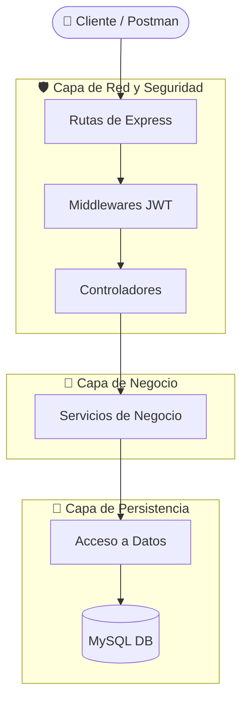

<div align="center">

# 🏥 Sistema de Gestión de Turnos Médicos


[](#)
[](#)
[](#)
[](#)

*Una API RESTful robusta, modular y segura, diseñada para optimizar los procesos operativos y el análisis de datos de instituciones de salud.*

</div>

---

## 🏛️ Información TFI PROGIII 
* **Universidad:** Universidad Nacional de Entre Ríos (UNER)
* **Facultad:** Facultad de Ciencias de la Administración (FCAD)
* **Carrera:** Tecnicatura Universitaria en Desarrollo Web (TUDW)
* **Cátedra:** Programación III

---

## 🏗️ Arquitectura del Sistema

Implementamos una arquitectura estricta basada en el patrón de **Separation of Concerns (Capas)** para garantizar escalabilidad y un código limpio.



---

## 📊 Modulo estadísticas

Se delega el cómputo matemático intensivo directamente al motor de BD:

> **Procedimiento Almacenado `pa_estadisticas`:** Libera el *Event Loop* de Node.js al ejecutar funciones de agregación (`SUM`, `COUNT`, `GROUP BY`) directamente en MySQL, optimizando el ancho de banda y garantizando reportes de métricas en milisegundos sin afectar la atención de pacientes.

---

## ⚡ Guía Rápida de Instalación

<details>
<summary><b>Haz clic para expandir las instrucciones de despliegue local</b></summary>

1. **Clona el repositorio:**
   ```bash
   git clone [https://github.com/arielLevita/prog3-turnos-grupoj.git](https://github.com/arielLevita/prog3-turnos-grupoj.git)
   cd prog3-turnos-grupoj
   git checkout develop
   ```
2. **Instala las dependencias:**
   ```bash
   npm install
   ```
3. **Variables de Entorno:**
   Copia el archivo `.env.ejemplo`, renómbralo a `.env` y ajusta tus credenciales. *(Recomendación de seguridad: No uses el usuario root)*.
4. **Base de Datos:**
   Importa los scripts de la carpeta `db/procedimientos` en tu servidor MySQL.
5. **Ejecuta la API:**
   ```bash
   npm run dev
   ```

</details>

---

## 👨‍💻 Equipo de Desarrollo (Grupo J)

<div align="center">

| <a href="https://github.com/wox9000"><br /><sub><b>Walter Cuesta</b></sub></a> | <a href="https://github.com/arielLevita"><br /><sub><b>Ariel Levita</b></sub></a> | <a href="https://github.com/Elisa-Beltramone"><br /><sub><b>Elisa Beltramone</b></sub></a> |
| :---: | :---: | :---: |
| <a href="https://github.com/GabrielORoman"><br /><sub><b>Gabriel Roman</b></sub></a> | <a href="https://github.com/MaryOlivares"><br /><sub><b>María Olivares</b></sub></a> | <a href="https://github.com/NerinaBonnin"><br /><sub><b>Nerina Bonnin</b></sub></a> |

</div>
